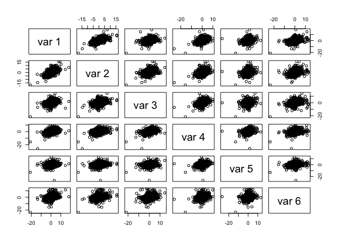
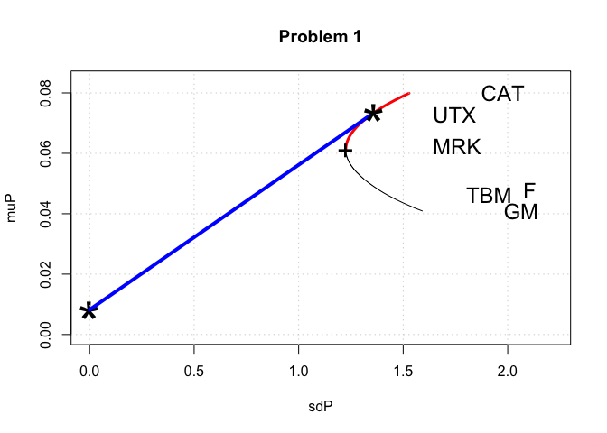

5261 Hw4
================
2023-10-12

``` r
dat = read.csv("/Users/kensong/Desktop/找找资料/Stock_Bond.csv", header = T)
   prices = cbind(dat$GM_AC, dat$F_AC, dat$CAT_AC, dat$UTX_AC,
      dat$MRK_AC, dat$IBM_AC)
   n = dim(prices)[1]
   returns =  100 * (prices[2:n, ] / prices[1:(n-1), ] - 1)
   pairs(returns)
```

<!-- -->

``` r
   mean_vect = colMeans(returns)
   cov_mat = cov(returns)
   sd_vect = sqrt(diag(cov_mat))
```

# Question 1

``` r
library(quadprog)


efficient_frontier = function(returns, muP, mufree=0.0, w_lower_limit=-Inf, w_upper_limit=+Inf){

  n_stocks = dim(returns)[2]
  
  # Extract individual equity (mean return, std return) values: 
  mean_vect = apply(returns, 2, mean)
  cov_mat = cov(returns)
  sd_vect = sqrt(diag(cov_mat))
  
  # Portfolio weight constraints:
  #
  #     first condition enforce \sum w_j = 1
  #     second condition enforce \sum mu_j w_j = mu_target
  #             
  Amat = cbind(rep(1,n_stocks),mean_vect)
  bvec = c(1,NaN)
  if( is.finite(w_lower_limit) ){
    Amat = cbind(Amat, diag(1, nrow=n_stocks))
    bvec = c(bvec, w_lower_limit*rep(1,n_stocks))
  }
  if( is.finite(w_upper_limit) ){
    Amat = cbind(Amat, -diag(1, nrow=n_stocks))
    bvec = c(bvec, -w_upper_limit*rep(1,n_stocks))
  }

  # storage for results: 
  sdP = muP
  weights = matrix(0, nrow=length(muP), ncol=n_stocks)

  # find the optimal portfolios for each target expected return:
  #
  for( i in 1:length(muP) ){
    bvec[2] = +muP[i] # enforce portfolio mean constraint 
    result = solve.QP(Dmat=2*cov_mat, dvec=rep(0,n_stocks), Amat=Amat, bvec=bvec, meq=2)
    sdP[i] = sqrt(result$value)
    weights[i,] = result$solution 
  }

  # Find maximum Sharpe portfolio: 
  sharpe = ( muP - mufree ) / sdP 
  ind_ms = which.max(sharpe)

  # Find minimum variance portfolio: 
  ind_mv = which.min(sdP)
  
  list(mufree=mufree, mean_vect=mean_vect, cov_mat=cov_mat, sd_vect=sd_vect,
       muP=muP, sdP=sdP, weights=weights,
       sharpe=sharpe, max_sharpe=sharpe[ind_ms], max_sharpe_ind=ind_ms,
       min_variance=sdP[ind_mv]^2, min_variance_ind=ind_mv )
}


dat = read.csv("/Users/kensong/Desktop/找找资料/Stock_Bond.csv", header=TRUE)
prices = cbind(dat$GM_AC, dat$F_AC, dat$CAT_AC, dat$UTX_AC, dat$MRK_AC, dat$IBM_AC)
n = dim(prices)[1]
returns = 100 * ( prices[2:n,] / prices[1:(n-1),] - 1 )
#pairs(returns)

mean_vect = colMeans(returns)
cov_mat = cov(returns)
sd_vect = sqrt(diag(cov_mat) )

mufree = 3/365

muP = seq(min(mean_vect), max(mean_vect), length.out=500)

result = efficient_frontier(returns, muP, mufree, w_lower_limit=-0.1, w_upper_limit=0.5)

mean_vect = result$mean_vect
sd_vect = result$sd_vect
weights = result$weights
ind_ms = result$max_sharpe_ind

plot_efficient_frontier = function(result, title=''){
    #
    # Plots the output from a call to the function "efficient_frontier".
    #
    # weights[ind_ms, ] # print the weights of the tangency portfolio
    #

    # Unpack:
    #
    mufree = result$mufree
    muP = result$muP
    sdP = result$sdP
    weights = result$weights
    sharpe = result$sharpe
    ind_ms = result$max_sharpe_ind
    ind_mv = result$min_variance_ind
    mean_vect = result$mean_vect
    sd_vect = result$sd_vect
    
    max_sdP = max(c(sdP, sd_vect))
    x_lim_max = 1.05*max_sdP
    max_muP = max(c(muP, mean_vect))
    y_lim_max = 1.05*max_muP
    
    plot(sdP, muP, type='l', xlim=c(0, x_lim_max), ylim=c(0, y_lim_max), xlab='sdP', ylab='muP', main=title)
    ind3 = (muP > muP[ind_mv])
    lines(sdP[ind3], muP[ind3], type='l', lwd=3, col='red')
    points(0, mufree, cex=4, pch='*')
    grid()

    # Plot the tangency portfolio:
    #
    sdP_max = sdP[ind_ms]
    lines(c(0, sdP_max), mufree + c(0, sdP_max) * (muP[ind_ms] - mufree)/sdP[ind_ms], lwd=4, lty=1, col='blue')
    points(sdP[ind_ms], muP[ind_ms], cex=4, pch='*') # tangency portfolio

    points(sdP[ind_mv], muP[ind_mv], cex=2, pch='+') # min variance portfolio
}

plot_efficient_frontier(result, 'Problem 1')

print(round(weights[ind_ms,], 4)) # print the weights of the tangency portfolio
```

    ## [1] -0.0917 -0.0031  0.3359  0.3841  0.3195  0.0552

``` r
text(sd_vect[1], mean_vect[1], 'GM', cex=1.5)
text(sd_vect[2], mean_vect[2], 'F', cex=1.5)
text(sd_vect[3], mean_vect[3], 'CAT', cex=1.5)
text(sd_vect[4], mean_vect[4], 'UTX', cex=1.5)
text(sd_vect[5], mean_vect[5], 'MRK', cex=1.5)
text(sd_vect[6], mean_vect[6], 'TBM', cex=1.5)
```

<!-- -->

# Question 2

``` r
ind = result$max_sharpe_ind

E_R_P = 0.0007 * 100 # the desired return (as a percent)
E_R_T = result$muP[ind] # the return of the tangency portfolio
c( E_R_P, E_R_T, mufree )
```

    ## [1] 0.070000000 0.073411544 0.008219178

``` r
omega = ( E_R_P - mufree ) / ( E_R_T - mufree )
print(sprintf("omega= %10.6f", omega) )
```

    ## [1] "omega=   0.947670"

``` r
print("Tangency porfolio weights:")
```

    ## [1] "Tangency porfolio weights:"

``` r
weights_stock = omega*result$weights[ind,]
print(weights_stock)
```

    ## [1] -0.086866909 -0.002917908  0.318313977  0.364024462  0.302827793  0.052288168

``` r
S = 100000
investments_stock = S * weights_stock

# Adding the risk-free asset's weight and investment manually
weights_rf = 1 - sum(weights_stock)  # Assuming full investment of capital S
investments_rf = S * weights_rf 

# Define stock names
stocks <- c("GM", "F", "CAT", "UTX", "MRK", "IBM", "risk-free asset")

# Combine investments and names to include risk-free asset
investments <- c(investments_stock, investments_rf)
weights <- c(weights_stock, weights_rf)

# Iterate through each stock and print allocation
for (i in 1:length(stocks)) {
  operation <- ifelse(investments[i] < 0, "Short", "Go long")
  print(sprintf("%s %0.9f(%d) = %0.4f dollars worth of %s", operation, weights[i], S, investments[i], stocks[i]))
}
```

    ## [1] "Short -0.086866909(100000) = -8686.6909 dollars worth of GM"
    ## [1] "Short -0.002917908(100000) = -291.7908 dollars worth of F"
    ## [1] "Go long 0.318313977(100000) = 31831.3977 dollars worth of CAT"
    ## [1] "Go long 0.364024462(100000) = 36402.4462 dollars worth of UTX"
    ## [1] "Go long 0.302827793(100000) = 30282.7793 dollars worth of MRK"
    ## [1] "Go long 0.052288168(100000) = 5228.8168 dollars worth of IBM"
    ## [1] "Go long 0.052330417(100000) = 5233.0417 dollars worth of risk-free asset"

# Question 3

``` r
# Convert string to Date object
black_monday <- as.Date("19-Oct-87", format="%d-%b-%y")

# Check if Black Monday is in the dataset
# Ensure your Date column is in the correct format or convert it
dat$Date <- as.Date(dat$Date, format="%d-%b-%y")

is_black_monday_included <- black_monday %in% dat$Date

# Output result
if (is_black_monday_included) {
  print("Yes, the dataset includes Black Monday.")
} else {
  print("No, the dataset does not include Black Monday.")
}
```

    ## [1] "Yes, the dataset includes Black Monday."
